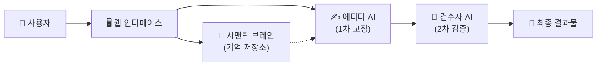

# 🦅 AI 기반 스마트 속기록 검수 시스템 (AI Meeting Proofreader)
---
#### 서비스 URL: https://meeting-proofreader-483086982600.asia-northeast3.run.app
---
> **"단순한 맞춤법 검사기가 아닙니다. 회의의 '맥락'을 이해하는 AI 파트너입니다."**

이 프로젝트는 속기사가 작성한 회의록(속기록)의 오타와 비문, 그리고 문맥상 어색한 표현을 **최신 AI 기술**을 활용해 자동으로 교정해주는 지능형 시스템입니다. 개발 지식이 없는 사용자도 웹페이지에서 클릭 몇 번으로 전문가 수준의 검수 결과를 얻을 수 있도록 설계되었습니다.

---

## 📖 1. 프로젝트 소개 (Introduction)

일반적인 맞춤법 검사기는 "회의록"를 "회의 록"으로 잘못 고치거나, 회의 참석자의 이름을 엉뚱한 단어로 바꾸곤 합니다. 이는 **'문맥(Context)'**을 모르기 때문입니다.

본 시스템은 **RAG (Retrieval-Augmented Generation)** 기술과 **Multi-Agent(다중 AI 협업)** 구조를 도입하여 해결했습니다.
1. **입력한 회의 메타데이터**를 AI가 먼저 학습합니다.
2. 문장을 단순히 고치는 것이 아니라, "이 상황에서 이 말이 맞는가?"를 판단합니다.
3. 수정 전과 후를 **색상(빨강/초록)**으로 한눈에 비교해서 보여줍니다.

---

## 🚀 2. 사용 방법 (User Guide)

복잡한 설치 없이, 웹 브라우저만 있으면 됩니다.

1. **접속하기**: 제공된 웹 주소로 접속합니다.
2. **파일 업로드**: 검수할 속기록 파일(`.txt` 등)을 드래그해서 넣습니다.
3. **정보 입력 (선택)**: 더 정확한 교정을 위해 회의 주제나 참석자 이름을 입력창에 적어주세요. (AI가 이를 참고하여 고유명사 오타를 방지합니다.)
4. **검수 시작**: 버튼을 누르면 AI가 문서를 읽고 교정을 시작합니다.
5. **결과 확인**:
    - **빨간색 취소선**: AI가 삭제하거나 수정한 부분
    - **초록색 굵은 글씨**: AI가 제안하는 올바른 표현
    - 완료된 파일은 **[다운로드]** 버튼을 눌러 저장할 수 있습니다.

---

## 🏗️ 3. 시스템 아키텍처 (System Architecture)

> **"이 시스템은 마치 <편집장>과 <교열 기자>, 그리고 <도서관>이 협업하는 구조입니다."**

이 시스템은 거대 언어 모델(LLM) 하나에 의존하지 않고, **역할이 분담된 여러 AI**가 협업하는 **파이프라인 구조**를 가지고 있습니다.



### 🔍 핵심 구성 요소 (Key Components)

#### 1. 시맨틱 브레인 (Semantic Layer & Vector Memory) 🧠
*   **역할**: 도서관 사서
*   **설명**: 사용자가 입력한 회의 정보(참석자, 주제)를 **벡터(Vector)** 형태의 수학적 신호로 변환하여 장기 기억 장소에 저장합니다.
*   **기술**: **Numpy 기반 경량 벡터 데이터베이스**를 자체 구축하여, 외부 서버 없이도 빠르고 안전하게 정보를 검색합니다.

#### 2. 에디터 에이전트 (Editor Agent) ✍️
*   **역할**: 유능한 교열 기자
*   **설명**: 문장을 읽다가 모르는 단어가 나오면 '시맨틱 브레인'에게 물어봅니다. *"이게 사람 이름인가요, 기술 용어인가요?"* 답변을 바탕으로 오타를 수정합니다.
*   **기술**: **LangGraph**를 활용한 에이전트 제어 기술이 적용되었습니다.

#### 3. 비주얼 디프 엔진 (Visual Diff Engine) 👁️
*   **역할**: 인쇄소
*   **설명**: 원본과 수정본을 글자 단위로 정밀하게 비교하여, 사람이 한눈에 알아볼 수 있는 **Highlight HTML** 코드를 생성합니다.

---

## 🛠️ 4. 기술 스택 (Tech Stack)

| 구분 | 기술 (Technology) | 설명 |
| :--- | :--- | :--- |
| **Frontend** | **Streamlit** | 데이터 사이언스에 특화된 직관적인 웹 대시보드 프레임워크 |
| **AI Brain** | **OpenAI GPT-4o** | 현존 최고 수준의 한국어 문맥 이해 능력을 가진 모델 |
| **Logic** | **LangGraph** | 복잡한 AI의 생각 과정을 순서도처럼 제어하는 최신 라이브러리 |
| **Data** | **Custom Numpy Vector Store** | 빠르고 가벼운 자체 제작 검색 엔진 |
| **Cloud** | **GCP Cloud Run** | 구글 클라우드 기반의 서버리스 배포 (언제 어디서나 접속 가능) |

---

```

---
*Created by To가람 Project Team*
